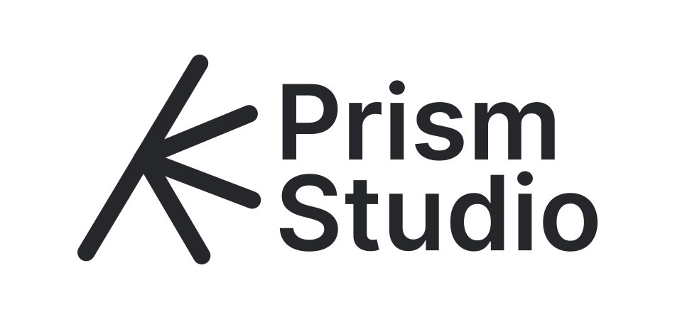
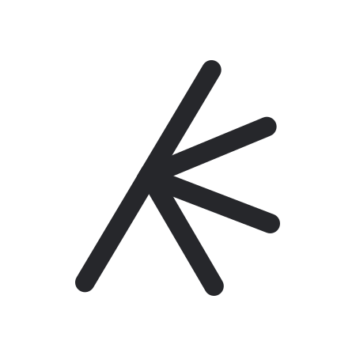

<div align="center">



**Independent software development studio.**

We build fast, clean and thoughtfully designed software —  
from JVM applications to native tools and open-source projects.

<br>


<br>

[About](#about) • [What we build](#what-we-build) • [Tech stack](#tech-stack) • [Open source](#open-source) • [Discord](https://discord.gg/adurdpTcMW)

</div>

---

## About

**Prism Studio** is a software development studio focused on modern desktop applications, developer tools, system utilities and open-source software.

We care about:

- **Performance** — software should feel fast.
- **Architecture** — code should stay clean as projects grow.
- **Design** — good software should be pleasant to use.
- **Simplicity** — fewer moving parts, clearer solutions.

Our work combines the productivity of the **JVM ecosystem** with the control and performance of **native technologies**.

---

## What we build

```text
Prism Studio
├── Desktop Applications
├── Multiplatform Software
├── Developer Tools
├── System Utilities
├── Libraries
└── Open Source Projects
```

We experiment, build, refine and publish projects that we believe are useful.

---

## Tech stack

| Area | Technologies |
|---|---|
| **Languages** | Kotlin, Java, Rust, Zig |
| **UI** | Jetpack Compose, Compose Multiplatform |
| **JVM** | Kotlin, Java, Gradle |
| **Native** | Rust, Zig |
| **Platforms** | Desktop, JVM, Native |
| **Tools** | Git, GitHub, Gradle |

---

## Kotlin & Java

Kotlin is at the center of many of our application projects.

We use the JVM ecosystem for:

- desktop software;
- application logic;
- multiplatform projects;
- libraries and tooling.

```kotlin
fun main() {
    println("Built by Prism Studio.")
}
```

---

## Rust & Zig

For software where low-level control, native performance or system integration matters, we work closer to the hardware.

```text
Rust  → safety + performance
Zig   → simplicity + low-level control
```

---

## Jetpack Compose

We use **Jetpack Compose** and **Compose Multiplatform** to build modern declarative interfaces.

Our UI philosophy is simple:

> Clean interfaces.  
> Clear interactions.  
> No unnecessary complexity.

---

## Open Source

Some of our tools, libraries and experiments are published here as open source.

Feel free to:

- explore the source code;
- report bugs;
- suggest improvements;
- contribute to projects;
- fork something and build your own version.

---

## Community

Join our Discord server to follow development, discuss architecture, or share feedback:

[](https://discord.gg/adurdpTcMW)

---

## Projects

Our repositories contain projects at different stages — from experiments and prototypes to actively developed software.

Check the pinned repositories on our GitHub profile to see what we are currently building.

---

<div align="center">

 **Prism Studio**

`Kotlin` · `Java` · `Rust` · `Zig` · `Jetpack Compose` · [`Discord`](https://discord.gg/YOUR_INVITE)

</div>
